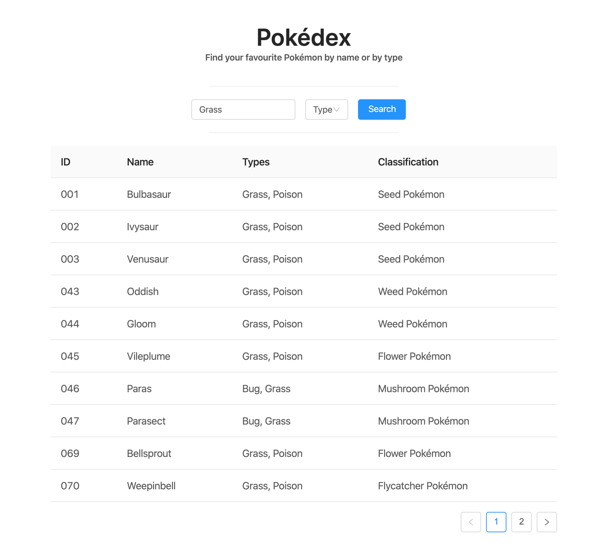

# Pokédex

## Table of Contents

- [The goal](#the-goal)
- [Structure](#structure)
- [Install](#install)
- [Serve](#serve)
- [Used libraries](#used-libraries)

---

### The goal

The main goal of the application is to provide an UI for searching Pokémons which can be searched by name or by type.

[Read the assignment](ASSIGNMENT.md).



### Structure

The main work has been done in the `client` directory.
[webpack](https://webpack.js.org/) is the bundler which creates two files inside the `public/dist` folder:

- pokedex.css
- pokemon.js

The `clients/src/index.ts` file is the app's entry point. Basically it wraps the `App.tsx` (the root component) inside the `ApolloProvider` to make the Apollo's client available in the entire application.

### Install

First of all you have to install `yarn` dependencies

```
yarn install
```

Then you have to compile the application

```
yarn build
```

You can also compile it in dev mode

```
yarn dev
```

### Serve

Once the app has been compiled, you can serve it by running:

```
yarn serve
```

This will launch a local server that will point to the `public/index.html` file.

Obviously you have to run the GraphQL server. Move to `packages/server` folder and launch the following command

```
yarn start
```

The server will be on listening at `http://localhost:4000`

### Used libraries

This project is made with the following libraries:

- ✅ [TypeScript](https://www.typescriptlang.org)
- ✅ [React](https://reactjs.org/)
- ✅ [Apollo Client/Server](https://www.apollographql.com/)
- ✅ [antd](https://ant.design/)
- ✅ [Lodash](https://lodash.com)

### Original resource

Based on [Satispay's Front End Assignment](https://github.com/satispay/frontend-assignment) repository.
